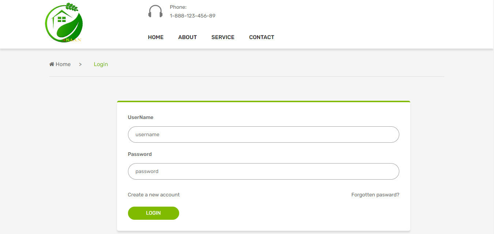
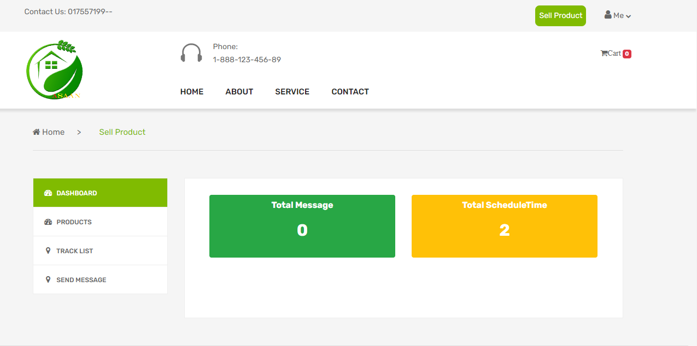
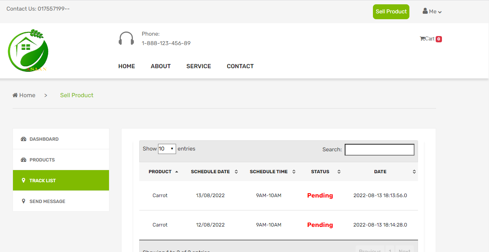
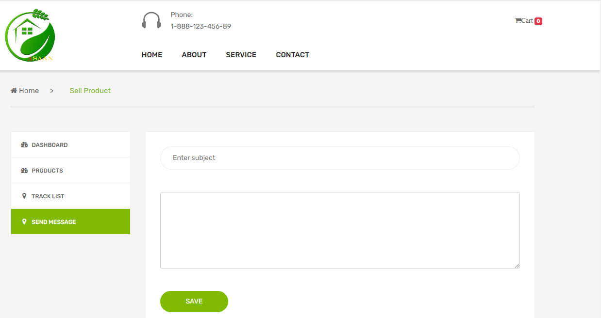
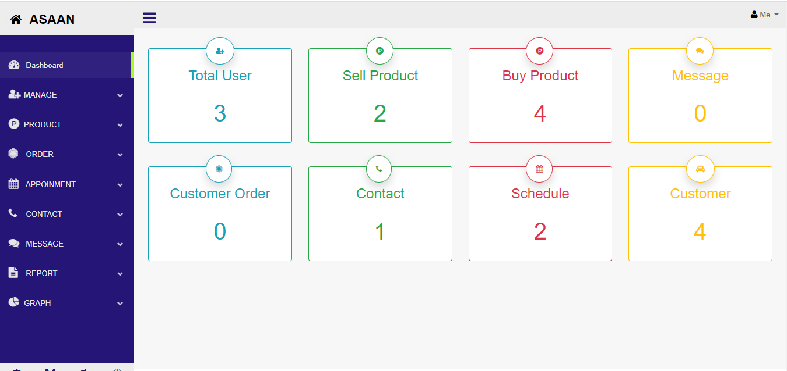

# ASAAN
This project name is “ASAAN”. This application is developed using Spring Boot, Jquery, JavaScript, Mysql, Theamleaf template engine.The main purpose of this application is .First of all you need to visit this application and search university name then you need to enter department name and student id.After searching you will find student information if student department and Id is match show a cerficate and you will print it otherwise this application shows "your searching information is not available".
 
<h3>Featurs</h3>
<h4>Users:</h4>
* View Posts  
* Search University Name 
* Search Student 
* Print certificate 
<h4>Admin:</h4>
* Add University  
* Add Student  
* Add Batch Info  
* Add Departement university wise  
* Create university link  
* Add Post  
* Mange messages  
 

 

 

 

 

 

 
