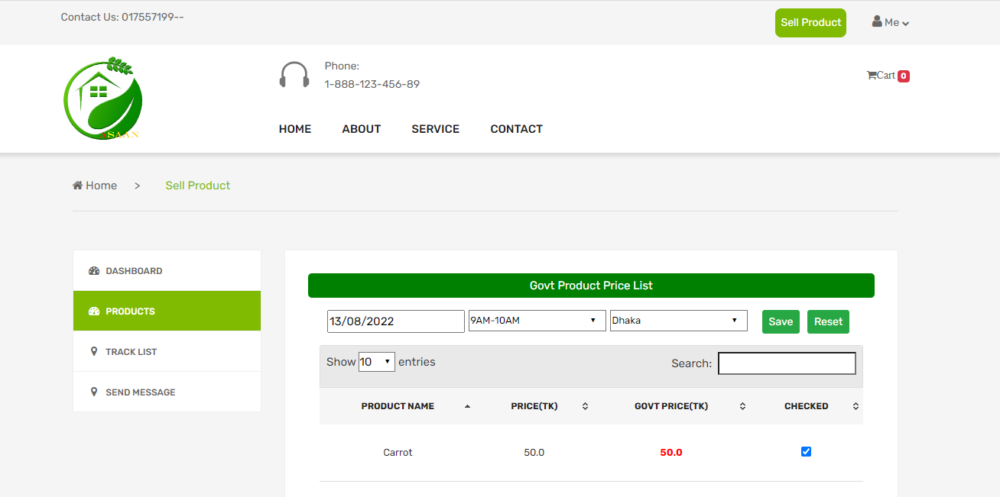
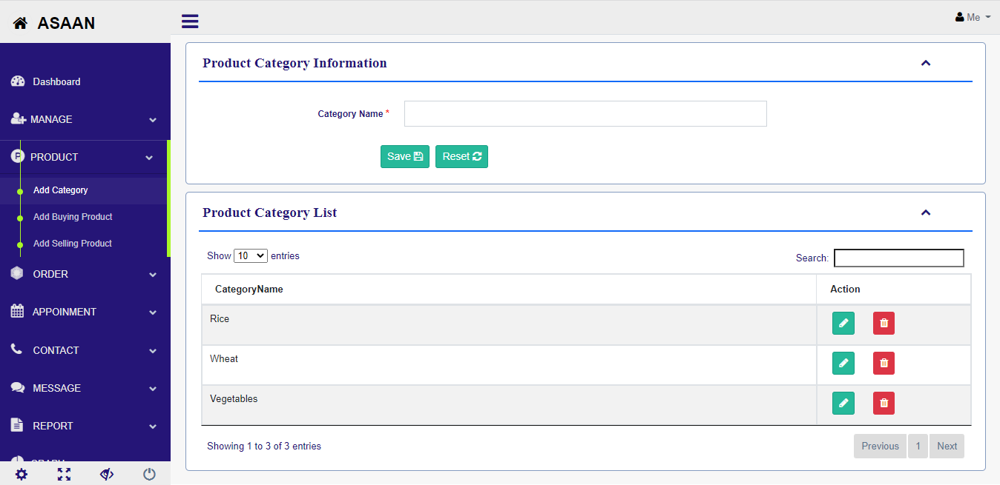
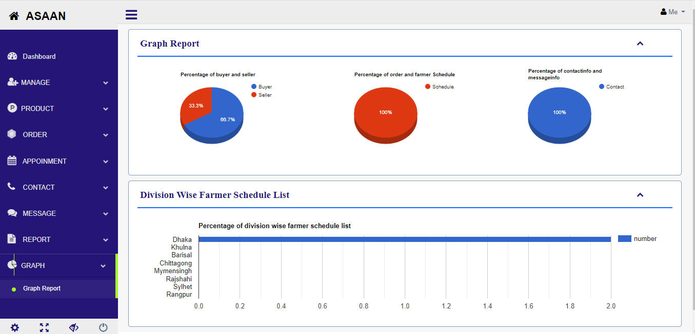

# ASAAN
This project name is “ASAAN”. This application is developed using Spring Boot, Jquery, JavaScript, Mysql, Theamleaf template engine.The main purpose of this application is selling various types of product from Bangladesh to others foreign country like Dubai.There are three types of user in this application like buyer,seller and admin.First of all go to this application if your location is banglaesh you can see the selling options otherwise you can see buyer options that
means only foreign country can buy their product and only bangladeshi farmers sells their product without third party peoples using this application.
 
<h3>Featurs</h3>
<h4>Seller:</h4>
* DashBoard  
* See the govment product price list 
* View his/her product list 
* View the tracking list
* Can send message to asaan 
* <h4>Buyers:</h4>
* DashBoard  
* View his/her product list 
* View the tracking list
* View cart list
* Payment details
* Can send message to asaan 
<h4>Admin:</h4>
* Manage users  
* Manage product  
* Manage orders  
* Manage messages  
* Manage appoinment  
* Generate [Jasper Report]  
* Generate [Graph Report]  
 
 

 

 

 

 

 

 
